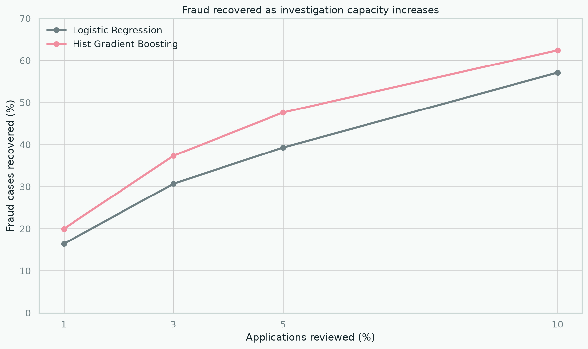
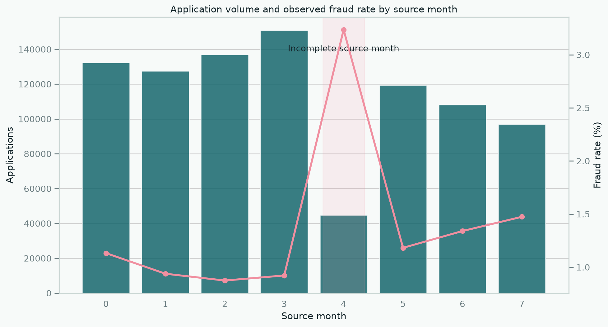
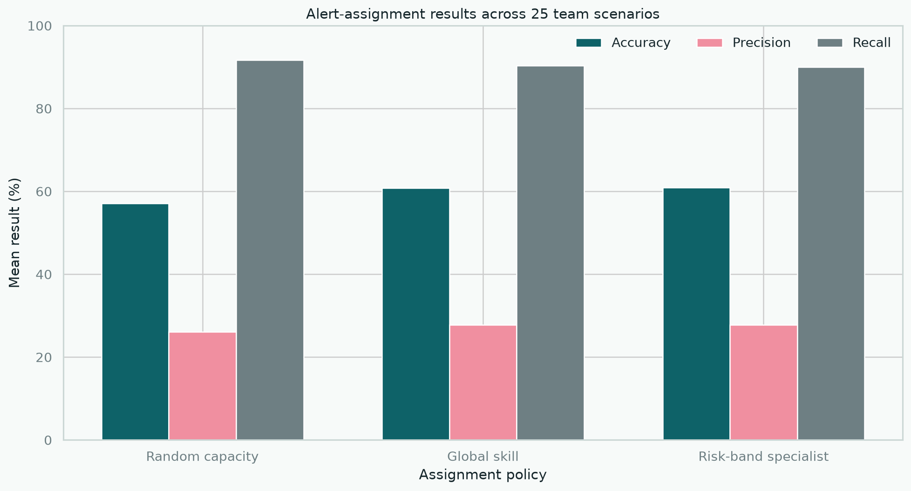

# Financial Fraud Detection & Alert Prioritisation

**From bank-account applications to a review queue that investigators can realistically handle.**

This project examines two connected stages of fraud operations: ranking new account applications by risk and deciding which alerts should be reviewed when investigation capacity is limited.

The work uses the Financial Fraud Alert Review Dataset (FiFAR), a synthetic research dataset that combines bank-account application records, fraud labels, model scores, decisions from 50 synthetic fraud analysts and team-capacity scenarios.

> This is an analytical portfolio project based on synthetic data. It is not a production fraud system and must not be used for real lending or account-opening decisions.

## Why this project matters

Fraud models are often evaluated as if every flagged case can be investigated. In practice, an alert has value only when it can enter a manageable review process. The central question is therefore:

> How much fraud can be recovered within a fixed review capacity, and what is the false-positive burden created by that decision?

The project does not optimise accuracy. It evaluates ranking quality, fraud captured, precision within the review queue, monthly stability and subgroup behaviour.

## Verified data scope

| Component | Verified size | Purpose |
|---|---:|---|
| Supplied base applications | 917,174 | Application-level fraud modelling |
| Fraud cases in supplied base | 11,029 (1.20%) | Rare-event target |
| Author-scored applications | 602,961 | Benchmark score analysis |
| Selected alerts | 30,622 | Alert-review analysis |
| Fraud cases among alerts | 3,714 (12.13%) | Review-queue target |
| Synthetic fraud analysts | 50 | Capacity and assignment experiments |

The supplied base file is shorter than the one-million-row BAF release described in the source documentation and ends with one truncated row. Month 4 is materially incomplete. The project removes only the truncated row and excludes month 4 from primary temporal comparisons. The issue and its effect are documented in [Data source and scope](docs/DATA_SOURCE.md).

## Temporal evaluation

| Stage | Months | Applications |
|---|---|---:|
| Training | 0–3 | 547,975 |
| Excluded from primary comparison | 4 | 44,864 |
| Validation | 5–6 | 227,491 |
| Final test | 7 | 96,843 |

The final month remains outside model and threshold selection. `income`, `customer_age`, `employment_status` and `housing_status` are reserved for subgroup auditing and excluded from the primary model.

## Baseline results

The table below reports performance on the untouched final month.

| Model | Average precision | ROC AUC | Fraud captured at 3% capacity | Precision at 3% | Recall at 3% |
|---|---:|---:|---:|---:|---:|
| Logistic regression | 0.133 | 0.850 | 438 / 1,428 | 15.1% | 30.7% |
| Histogram gradient boosting | **0.179** | **0.874** | **533 / 1,428** | **18.3%** | **37.3%** |

At a 3% review capacity, the selected gradient-boosting model concentrates fraud from a base rate of 1.47% to 18.3% in the review queue. It still misses 895 fraud cases, so the result is useful but not sufficient.



The source-quality issue is visible in the monthly profile rather than hidden during preparation:



## Alert assignment results

The second stage tests how a fixed alert queue should be distributed across a synthetic review team. Analyst skill is estimated from alert months 3–6, then evaluated on month 7 across 25 supplied team-and-capacity scenarios.

| Assignment policy | Mean accuracy | Mean precision | Mean recall | Mean false positives |
|---|---:|---:|---:|---:|
| Random capacity | 57.15% | 26.12% | **91.73%** | 1,850.84 |
| Global skill | 60.79% | 27.75% | 90.34% | 1,679.04 |
| Risk-band specialist | **60.94%** | **27.78%** | 90.06% | **1,670.40** |

Risk-band assignment avoids about 180 false positives per scenario compared with random capacity allocation, but recall falls by 1.67 percentage points. Global skill performs nearly as well as the more detailed specialist policy. The choice is therefore presented as an operating trade-off, not a universal recommendation.



The full temporal design, assignment rules and limitations are documented in [Alert review and assignment](docs/ALERT_REVIEW.md).

## Project structure

```text
financial-fraud-detection/
├── config/                 # Reproducible split and feature policy
├── dashboard/              # Interactive review analysis
├── data/                   # Local raw, interim and processed data
├── docs/                   # Data source, methodology and model notes
├── images/                 # Figures used in the project documentation
├── models/                 # Locally generated model artefacts
├── notebooks/              # Full analytical workflow
├── reports/                # Reproducible metrics and audit outputs
├── scripts/                # Command-line entry points
├── sql/                    # DuckDB transformations and checks
├── src/fraud_detection/    # Reusable project code
└── tests/                  # Data and metric tests
```

## Notebook roadmap

| Notebook | Purpose |
|---|---|
| `01_data_source_and_quality.ipynb` | Verify the archive, schema, completeness and source limitations |
| `02_fraud_pattern_analysis.ipynb` | Examine target rarity, temporal change and application characteristics |
| `03_feature_policy_and_preparation.ipynb` | Define sentinels, encodings, protected-field policy and temporal split |
| `04_model_baselines.ipynb` | Establish prevalence and logistic-regression baselines |
| `05_model_comparison.ipynb` | Compare ranking models without touching the final month |
| `06_threshold_and_capacity.ipynb` | Convert scores into a manageable investigation queue |
| `07_analyst_review.ipynb` | Evaluate analyst variation and capacity-aware assignment |
| `08_stability_fairness_and_findings.ipynb` | Audit monthly and subgroup results, limitations and recommendations |

## Reproduce the current results

The dataset is not committed to this repository. Download `FiFAR.zip` from the [official Figshare record](https://doi.org/10.6084/m9.figshare.28351172), extract it and provide the extracted directory to the scripts.

```bash
python -m pip install -r requirements.txt

PYTHONPATH=src python scripts/run_data_audit.py \
  --source /path/to/FiFAR

PYTHONPATH=src python scripts/train_baselines.py \
  --base /path/to/FiFAR/alert_data/Base.csv

PYTHONPATH=src python scripts/evaluate_review_strategies.py \
  --source /path/to/FiFAR

PYTHONPATH=src python scripts/prepare_dashboard_data.py \
  --source /path/to/FiFAR

python scripts/run_monitoring_checks.py

python -m pytest -q
```

## Delivered scope

- Data provenance and archive integrity verified
- Source truncation documented
- Temporal split implemented
- Logistic-regression and gradient-boosting baselines trained
- Capacity-based evaluation implemented
- Capacity-aware alert assignment compared across 25 test scenarios
- Eight connected analytical notebooks
- Interactive Streamlit dashboard with publishable aggregates
- DuckDB monitoring views for monthly, capacity and assignment checks
- Automated tests and GitHub Actions quality checks

## References

- Alves, J. V. et al. *A benchmarking framework and dataset for learning to defer in human–AI decision-making.* Scientific Data.
- [Financial Fraud Alert Review Dataset (FiFAR)](https://doi.org/10.6084/m9.figshare.28351172)
- [Bank Account Fraud dataset documentation](https://github.com/feedzai/bank-account-fraud)
