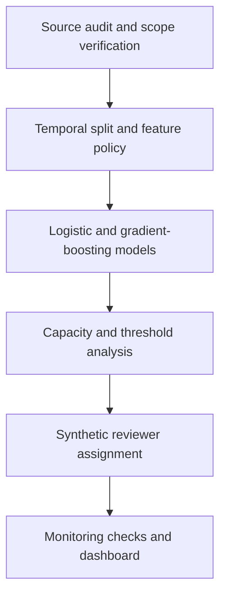

# Financial Fraud Detection & Alert Review

**From bank-account applications to a review queue that investigators can realistically handle.**

[](https://github.com/Nayanearaujo/financial-fraud-detection/actions/workflows/quality.yml)
[](https://financial-fraud-alert-review.streamlit.app/)
[](LICENSE)

This project connects two stages of fraud operations: ranking new account applications by risk and deciding which alerts should be reviewed when investigation capacity is limited. It combines temporal model validation, rare-event evaluation, workload planning and capacity-constrained alert assignment.

The analysis uses the Financial Fraud Alert Review Dataset (FiFAR), a synthetic research dataset containing bank-account applications, fraud labels, model scores, decisions from 50 synthetic fraud reviewers and 25 team-capacity scenarios.

> This is an analytical portfolio project based on synthetic data. It is not a production fraud system and must not be used for real lending or account-opening decisions.

**[Open the interactive dashboard](https://financial-fraud-alert-review.streamlit.app/)** · [Methodology](docs/METHODOLOGY.md) · [Data source](docs/DATA_SOURCE.md) · [Alert review](docs/ALERT_REVIEW.md) · [Reproduce the analysis](#reproduce-the-results)

## Executive result

The final-month test contains 96,843 applications and 1,428 observed fraud cases. At a review capacity of 3%, histogram gradient boosting creates a queue of 2,905 applications with the following result:

| Operating measure | Result |
|---|---:|
| Fraud cases captured | **533 of 1,428** |
| Fraud recovery | **37.3%** |
| Precision within the queue | **18.3%** |
| Lift over final-month prevalence | **12.4×** |
| Additional fraud captured vs logistic regression | **95 cases** |
| Fraud cases remaining outside the queue | **895** |

The result is useful because it connects model ranking to a realistic workload. It is not presented as an optimal production threshold: the source does not provide investigation cost, fraud-loss value or customer-friction cost.


## The operating question

Fraud models are often evaluated as if every flagged application can be investigated. In practice, a score creates value only when it supports a manageable review process. The central question is therefore:

> How much fraud can be recovered within a fixed review capacity, and what false-positive burden does that decision create?

Accuracy is not used as the primary model-selection measure. The project evaluates ranking quality, average precision, fraud captured at capacity, queue precision, monthly stability and subgroup behaviour.

## Analytical workflow



The final month remains untouched during model and threshold selection. Model performance and reviewer-assignment performance are evaluated as separate decisions before being brought together in the dashboard.

## Verified data scope

| Component | Verified size | Purpose |
|---|---:|---|
| Supplied base applications | 917,174 | Application-level fraud modelling |
| Fraud cases in supplied base | 11,029 (1.20%) | Rare-event target |
| Author-scored applications | 602,961 | Benchmark score analysis |
| Selected alerts | 30,622 | Alert-review analysis |
| Fraud cases among alerts | 3,714 (12.13%) | Review-queue target |
| Synthetic fraud reviewers | 50 | Capacity and assignment experiments |
| Final-month team scenarios | 25 | Assignment-policy comparison |

The supplied base file is shorter than the one-million-row BAF release described in the source documentation and ends with one truncated row. Month 4 is materially incomplete. The project removes only the truncated row, preserves month 4 in the audit trail and excludes it from primary temporal comparisons. The issue and its effect are documented in [Data source and scope](docs/DATA_SOURCE.md).


## Temporal evaluation design

| Stage | Months | Applications | Use |
|---|---|---:|---|
| Training | 0–3 | 547,975 | Fit model parameters |
| Excluded from primary comparison | 4 | 44,864 | Retained for source-quality reporting |
| Validation | 5–6 | 227,491 | Select model and operating threshold |
| Final test | 7 | 96,843 | Report final performance once |

`income`, `customer_age`, `employment_status` and `housing_status` are reserved for subgroup auditing and excluded from the primary model. This separation reduces the risk of directly using sensitive personal characteristics in the ranking decision; it does not by itself establish fairness.

## Final-month model comparison

| Model | Average precision | ROC AUC | Fraud captured at 3% | Queue precision | Fraud recovery |
|---|---:|---:|---:|---:|---:|
| Logistic regression | 0.133 | 0.850 | 438 / 1,428 | 15.1% | 30.7% |
| Histogram gradient boosting | **0.179** | **0.874** | **533 / 1,428** | **18.3%** | **37.3%** |

Histogram gradient boosting performs better on both ranking measures and captures more fraud at every tested review capacity. Logistic regression remains in the project as an interpretable reference rather than being removed after comparison.

## Alert-assignment results

The second stage tests how a fixed alert queue should be distributed across a synthetic review team. Reviewer performance is estimated from alert months 3–6 and evaluated on month 7 across 25 supplied team-and-capacity scenarios.

| Assignment policy | Mean accuracy | Mean precision | Mean recall | Mean false positives |
|---|---:|---:|---:|---:|
| Random capacity | 57.15% | 26.12% | **91.73%** | 1,850.84 |
| Global skill | 60.79% | 27.75% | 90.34% | 1,679.04 |
| Risk-band specialist | **60.94%** | **27.78%** | 90.06% | **1,670.40** |

Risk-band assignment avoids about 180 false positives per scenario compared with random allocation, but recall falls by 1.67 percentage points. Global skill performs almost as well as the more detailed specialist policy. The result is therefore an operating trade-off, not a universal recommendation.


The full temporal design, assignment rules and limitations are documented in [Alert review and assignment](docs/ALERT_REVIEW.md).

## Interactive dashboard

The [published Streamlit dashboard](https://financial-fraud-alert-review.streamlit.app/) presents the project through five connected views:

1. **Executive overview** — final-month model lift, workload and fraud coverage.
2. **Model performance** — ranking metrics and model comparison across review capacities.
3. **Review capacity** — interactive scenarios for 1%, 3%, 5% and 10% review workloads.
4. **Alert operations** — assignment-policy results and synthetic reviewer variation.
5. **Data quality** — source completeness, temporal coverage and interpretation boundaries.

Only compact, reproducible aggregates are published with the app. The raw research archive remains outside the repository.

## Project structure

```text
financial-fraud-detection/
├── config/                 # Reproducible split and feature policy
├── dashboard/              # Streamlit application and published aggregates
├── data/                   # Local raw, interim and processed data
├── docs/                   # Data source, methodology and alert-review notes
├── images/                 # Versioned figures used in documentation
├── models/                 # Locally generated model artefacts
├── notebooks/              # Eight-part analytical workflow
├── reports/                # Reproducible metrics and audit outputs
├── scripts/                # Command-line entry points
├── sql/                    # DuckDB monitoring views
├── src/fraud_detection/    # Reusable analysis and modelling code
└── tests/                  # Data, model, metric and SQL tests
```

## Notebook roadmap

The notebooks retain their verified tables and figures so they can be reviewed directly on GitHub. Every output is generated by the visible code and can be reproduced from the official source archive.

| Notebook | Purpose |
|---|---|
| `01_data_source_and_quality.ipynb` | Verify the archive, schema, completeness and source limitations |
| `02_fraud_pattern_analysis.ipynb` | Examine target rarity, temporal change and application characteristics |
| `03_feature_policy_and_preparation.ipynb` | Define sentinels, encodings, audit fields and temporal split |
| `04_model_baselines.ipynb` | Establish prevalence and logistic-regression baselines |
| `05_model_comparison.ipynb` | Compare ranking models without touching the final month |
| `06_threshold_and_capacity.ipynb` | Convert scores into a manageable investigation queue |
| `07_analyst_review.ipynb` | Evaluate synthetic reviewer variation and capacity-aware assignment |
| `08_stability_fairness_and_findings.ipynb` | Audit monthly and subgroup results, limitations and recommendations |

## Reproduce the results

The dataset is not committed to this repository. Download `FiFAR.zip` from the [official Figshare record](https://doi.org/10.6084/m9.figshare.28351172), extract it and pass the extracted directory to the scripts.

```bash
python -m pip install -r requirements.txt

PYTHONPATH=src python scripts/run_data_audit.py \
  --source /path/to/FiFAR

PYTHONPATH=src python scripts/train_baselines.py \
  --base /path/to/FiFAR/alert_data/Base.csv

PYTHONPATH=src python scripts/evaluate_review_strategies.py \
  --source /path/to/FiFAR

PYTHONPATH=src python scripts/prepare_dashboard_data.py \
  --source /path/to/FiFAR

python scripts/run_monitoring_checks.py
python -m pytest -q
```

## Quality controls

- Archive scope and source anomalies are recorded before modelling.
- Training, validation and final testing follow time order.
- The incomplete source month remains visible rather than being silently discarded.
- Final-month results are reported once after selection decisions.
- Published dashboard data can be regenerated from the versioned reports.
- DuckDB views monitor monthly volume, fraud rate, review capacity and assignment outcomes.
- Automated tests cover data alignment, temporal validation, capacity metrics, model behaviour, assignment constraints and SQL definitions.
- GitHub Actions runs the test suite on every pull request and every push to `main`.

## Interpretation boundaries

- Applications, reviewer decisions and team scenarios are synthetic.
- The source does not provide monetary loss, investigation cost or customer-friction cost.
- Removing protected fields from the model does not prove equal outcomes across groups.
- Reviewer simulations must not be interpreted as employee evaluation.
- Results demonstrate an analytical workflow, not production readiness.

## Tools used

Python · pandas · scikit-learn · Plotly · Streamlit · DuckDB SQL · pytest · GitHub Actions

## References

- Alves, J. V. et al. *A benchmarking framework and dataset for learning to defer in human–AI decision-making.* Scientific Data.
- [Financial Fraud Alert Review Dataset (FiFAR)](https://doi.org/10.6084/m9.figshare.28351172)
- [Bank Account Fraud dataset documentation](https://github.com/feedzai/bank-account-fraud)

## License

Released under the [MIT License](LICENSE).
